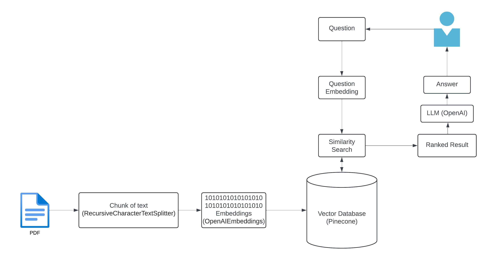

# QA Bot Solution

This repository contains a Jupyter notebook that demonstrates a QA (Question-Answering) bot solution. The notebook is designed to showcase the implementation and testing of the bot.

## High-Level Architecture



## Prerequisites

Ensure you have the following installed:

- Python 3.6 or higher
- Jupyter Notebook
- Required Python packages (listed in `requirements.txt`)

## Installation

1. **Clone the repository**

    ```bash
    git clone git@github.com:sushant2505/llm-assignment.git
    cd llm-assignment
    ```

2. **Create a virtual environment (optional but recommended)**

    ```bash
    python -m venv venv
    source venv/bin/activate  # On Windows, use `venv\\Scripts\\activate`
    ```

3. **Install the required packages**

    ```bash
    pip install -r requirements.txt
    ```

## Usage

1. **Launch Jupyter Notebook**

    ```bash
    jupyter notebook
    ```

2. **Open the notebook**

    In the Jupyter Notebook interface, navigate to the location of the `qa_bot_solution.ipynb` file and open it.

3. **Run the notebook**

    Execute the cells in the notebook sequentially to run the QA bot solution. The notebook is designed to guide you through the setup, implementation, and testing of the bot.

## Deployment

To deploy the QA bot solution, you may consider the following steps based on your specific use case:

1. **Export the Notebook to Python Script**

    You can convert the Jupyter notebook to a Python script using the following command:

    ```bash
    jupyter nbconvert --to script qa_bot_solution.ipynb
    ```

2. **Integrate with a Web Framework**

    - You can integrate the exported Python script into a web application using frameworks like Flask or Django.
    - Example structure for a Flask application:

        ```python
        from flask import Flask, request, jsonify
        # Import necessary components from the QA bot script

        app = Flask(__name__)

        @app.route('/ask', methods=['POST'])
        def ask():
            data = request.json
            question = data.get('question')
            # Use the QA bot solution to answer the question
            answer = get_answer(question)  # Assuming get_answer is a function in your script
            return jsonify({'answer': answer})

        if __name__ == '__main__':
            app.run(debug=True)
        ```

3. **Deploy to a Cloud Service**

    - Choose a cloud service provider (e.g., AWS, GCP, Azure, Heroku).
    - Follow the provider's documentation to deploy your web application.

## Contributing

If you wish to contribute to this project, please follow these steps:

1. Fork the repository.
2. Create a new branch (`git checkout -b feature-branch`).
3. Commit your changes (`git commit -am 'Add new feature'`).
4. Push to the branch (`git push origin feature-branch`).
5. Create a new Pull Request.

## License

This project is licensed under the MIT License.

---

If you have any questions or need further assistance, feel free to open an issue or contact the repository maintainer.
